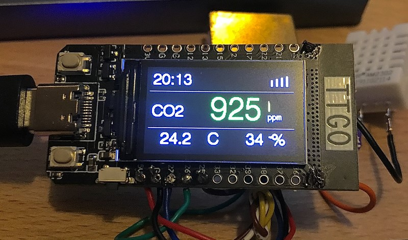
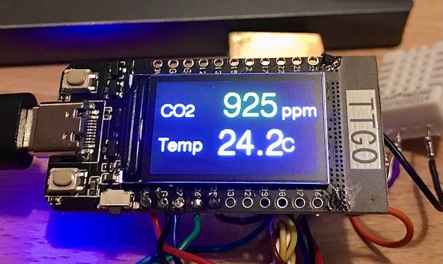
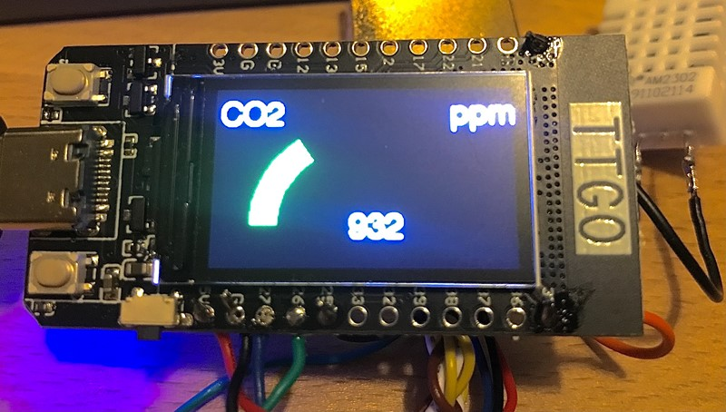

<h1> CO2 Sensor on TTGO with MQTT
</h1>
In order to reduce the number of wires and required soldering, this sensor is using the TTGO module.
  
The module is connected via MQTT to the home automation.
Using MQTT and NodeRED on a raspberry is enabling a simple and fast way to create a nice user interface.
In addition you can control the Sensor module as it is subscribing to a specific topic.
  
<h2> User Interface
</h2>

GUI 1 

 
GUI 2 

 
GUI 3 

 
GUI 4 

 
GUI 5 

 
GUI 6 
[[images/TTGO-6.jpg]]
 

  
<h2> CO2 Sensor
</h2>

  
<h2> Humidity and Temperature Sensor
</h2>

  
<h2> Wiring
</h2>

  
<h2> MQTT
</h2>

  
<h2> Configuration
</h2>
