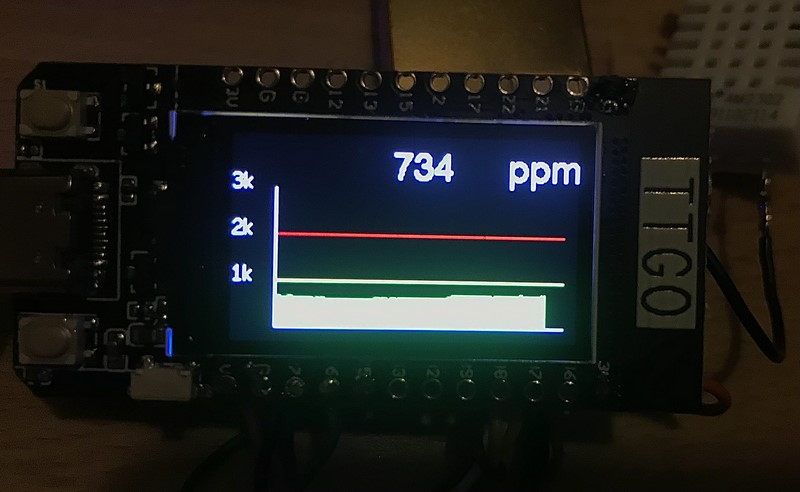
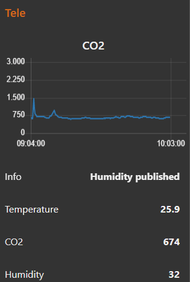
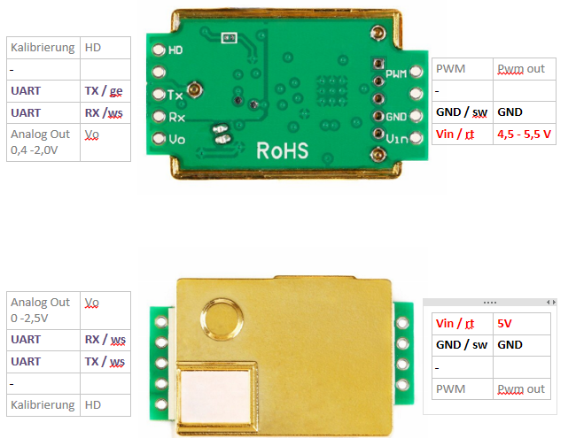
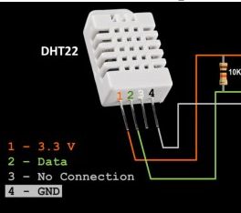

# CO2 Sensor on TTGO with MQTT
In order to reduce the number of wires and required soldering, this sensor is using the TTGO module.

The module is connected via MQTT to the home automation.
Using MQTT and NodeRED on a raspberry is enabling a simple and fast way to create a nice user interface.
In addition you can control the Sensor module as it is subscribing to a specific topic.

## User Interface
### GUI 1 - All Sensors

  
### GUI 2: CO2 + Temperature

 
### GUI 3: CO2 only - color depending on level

### GUI 4: CO2 gauge

### GUI 5: graph

###GUI 6: Admin page

### NodeRED

## CO2 Sensor / MHZ19B
Two good German resources which helped me to get started:
- https://unsinnsbasis.de/co2-sensor-mhz19b/
- http://steinlaus.de/stinkt-das-hier-teil-2-mit-dem-winsen-mh-z19b/#comment-18510
  
## Humidity and Temperature Sensor
The DHT22 is measuring both while using only one wire for data submission. As an alternative BME280 might be used.

  
## Wiring
### CO2 Sensor / MHZ19B

ESP PIN| ESP Name |MHZ19B Name
-------|----------|-----------
26	|RX|	TX
27	|TX|	REX
GND	|GND|	GND
5V	|V| Vin
  
### Temp/Humidity Sensor / DHT22

ESP PIN| ESP Name |DHT22 Name
-------|----------|-----------
25	|GPIO25|DATA
GND	|GND|	GND
3V3	|Vcc| Vcc

  
## MQTT
The name of this device is defined in include/myMqttClient.h.
Be aware that the name must be unique in your local network.
### Topics
- tele/TTGO-1/CO2
- tele/TTGO-1/info
- tele/TTGO-1/temp
- tele/TTGO-1/humi
- stat/TTGO/result
- cmnd/TTGO
### Commands - Message format
- {"name":"mode","value":3}

  
## Configuration
### TFT_esPI Library
You need to select the correct TFT driver in the library, otherwise the screen will just be black. 
Copy the files from 
- README\TFT_eSPI 
 to  
- .pio\libdeps\TTGO-MQTT-lora32-v1\TFT_eSPI

### WiFi + MQTT Credentials
Copy sample
- include\user_config_override_sample.h 
 to  
- included\user_config_override.h

Edit the file and inject your credentials.

  
## ToDo
- Calibration   
