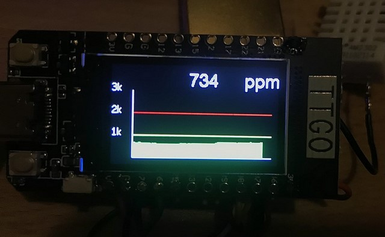

# CO2 Sensor on TTGO with MQTT

This is a project for measuring CO2 concentration as well as humidity and temperature. Different GUI modes are available.

In order to reduce the number of wires and required soldering, this sensor is using the TTGO module.

The module is connected via MQTT to the home automation solution.
A nice user interface is achieved via NoreRED running on a raspberry pi also connected via MQTT.
In addition you can control the Sensor module since it is subscribing to a specific topic.

## User Interface

### GUI 1 - All Sensors

Settings for this GUI: mode = 1

### GUI 2: CO2 + Temperature

Settings for this GUI: mode = 2

### GUI 3: CO2 only - color depending on level

Settings for this GUI: mode = 3

### GUI 4: CO2 gauge

Settings for this GUI: mode = 4

### GUI 5: graph

Settings for this GUI: mode = 5

### GUI 6: Admin page

Settings for this GUI: mode = 6

### GUI 0: Boot

Settings for this GUI: mode = 0

### NodeRED

## CO2 Sensor / MHZ19B

Two good German resources which helped me to get started:

- https://unsinnsbasis.de/co2-sensor-mhz19b/
- http://steinlaus.de/stinkt-das-hier-teil-2-mit-dem-winsen-mh-z19b/#comment-18510

## Humidity and Temperature Sensor

The DHT22 is measuring both while using only one wire for data submission. As an alternative BME280 might be used.

## Wiring

### CO2 Sensor / MHZ19B

| ESP PIN | ESP Name | MHZ19B Name |
| ------- | -------- | ----------- |
| 26      | RX       | TX          |
| 27      | TX       | RX          |
| GND     | GND      | GND         |
| 5V      | V        | Vin         |
  

### Temp/Humidity Sensor / DHT22

| ESP PIN | ESP Name | DHT22 Name |
| ------- | -------- | ---------- |
| 25      | GPIO25   | DATA       |
| GND     | GND      | GND        |
| 3V3     | Vcc      | Vcc        |

  

## MQTT

The name of this device is defined in include/user_config.h.
This name is used as client-ID for MQTT.
Be aware that the name / client-ID must be unique in your local network.
Default name: "TTGO-1"

For the time being, the MQTT user nad password are ignored.

### Topics

- tele/\<name\>/... ?
- tele/TTGO-1/CO2
- tele/TTGO-1/info
- tele/TTGO-1/temp
- tele/TTGO-1/humi
- stat/TTGO/result
- cmnd/TTGO

### Commands - Message format

- {"name":"mode","value":3}

| Command     | Value | Reason            |
| :---------- | :---- | :---------------- |
| mode        | 0...6 | Select GUI        |
| calibration | 1     | Start calibration |

  

## Configuration

Copy the files from

| Settings                | From                                  | To                                        | Reason                                                                                            |
| :---------------------- | :------------------------------------ | :---------------------------------------- | :------------------------------------------------------------------------------------------------ |
| TFT Driver              | README\TFT_eSPI                       | .pio\libdeps\TTGO-MQTT-lora32-v1\TFT_eSPI | You need to select the correct TFT driver in the library, otherwise the screen will just be black |
| WLAN + MQTT Credentials | include\user_config_override_sample.h | included\user_config_override.h           | Modify this to match your credentials.                                                            |

## ToDo

- Calibration   
Is already build in but not tested yet
